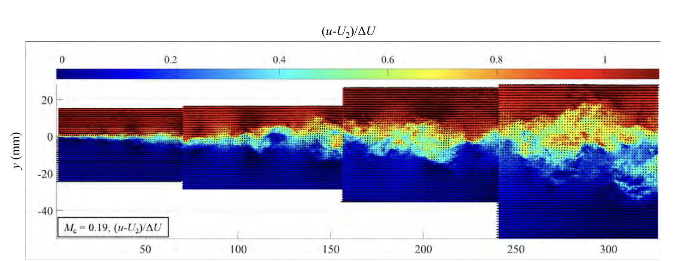
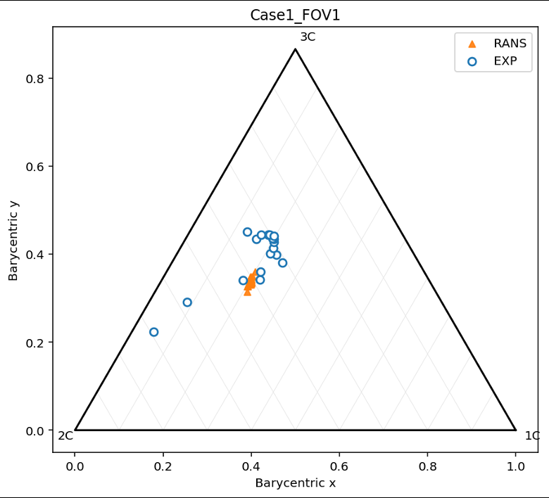
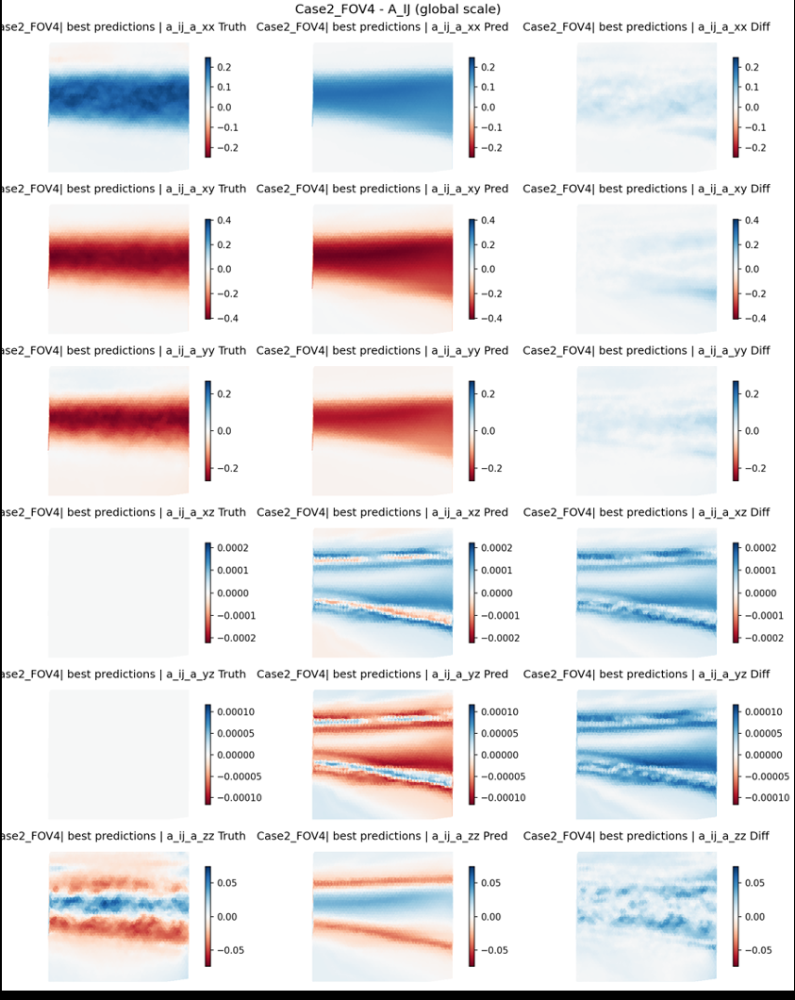
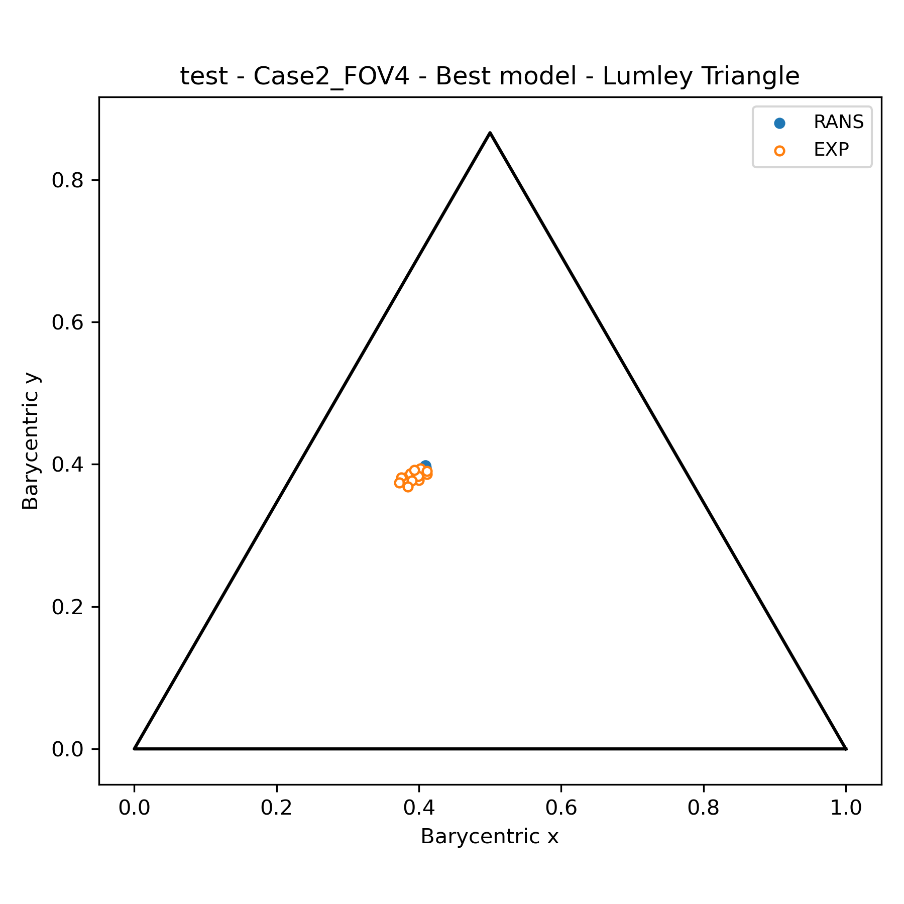
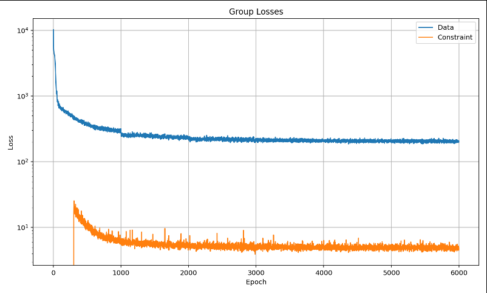

# Data-Driven Turbulence Modeling for Compressible Shear Mixing

Physics-informed machine-learning models for recovering Reynolds-stress anisotropy and related turbulence quantities from RANS solutions in compressible turbulent shear layers.

This repository preserves the code, experiment structure, and research artifacts from a 2025 turbulence-modeling project conducted at **NASA Glenn Research Center**. The work focused on learning experimentally observed turbulence structure from matched RANS solutions so that predicted Reynolds-stress anisotropy is not restricted by the Boussinesq plane-of-strain limitation.

> **Repository status:** frozen research artifact.  
> The codebase is preserved in its 2025 state. Trained checkpoints, generated plots, and other run artifacts were gitignored and are not included. Current updates are limited to documentation, slides, report material, and representative figures.


*Normalized shear-layer velocity field from the NASA/UIUC compressible mixing-layer experiment used as the primary validation dataset for this project (reproduced from the accompanying report; not generated by this repository).*

---

## Problem Statement

Reynolds-Averaged Navier-Stokes (RANS) models are widely used in turbomachinery because they are computationally inexpensive compared with Large-Eddy Simulation (LES) or Direct Numerical Simulation (DNS). Their accuracy, however, depends on turbulence closure.

For common eddy-viscosity models, the Reynolds stress is closed with the Boussinesq approximation,

$$-\rho \overline{u_i' u_j'} =2\mu_t S_{ij}- \frac{2}{3}\rho k\delta_{ij}$$

where

$$
S_{ij} =
\frac{1}{2}
\left(
\frac{\partial u_i}{\partial x_j}
+
\frac{\partial u_j}{\partial x_i}
\right).
$$

This directly ties Reynolds-stress anisotropy to the local mean strain rate. In anisotropy space, that restriction confines conventional eddy-viscosity RANS predictions to the plane of strain and prevents them from representing the full turbulence structure observed in shear-mixing layers.

The central question of this project is:

> **Can a machine-learning model recover experimentally observed Reynolds-stress anisotropy from lower-cost RANS-derived quantities while preserving the physical structure of the turbulence tensor?**

The original application was compressible turbulent shear mixing representative of the flow produced downstream of a turbine-blade trailing edge.

---

## Scientific Motivation

A major turbomachinery loss mechanism occurs near blade trailing edges, where pressure-side and suction-side flows merge into a turbulent shear layer. The resulting turbulence is strongly anisotropic, and the shape of the Reynolds-stress tensor affects mixing, momentum transport, loss generation, and downstream blade-row behavior.

RANS remains attractive because of cost, but the Boussinesq approximation prevents common $k-\omega$ SST and $k-\epsilon$ closures from reproducing the full range of anisotropy observed experimentally.

The project therefore treats turbulence closure as a supervised learning problem:

```text
Experimental turbulence measurements
                  +
       Matched RANS simulations
                  ↓
      Physics-derived features
                  ↓
  Nondimensionalization / scaling
                  ↓
      FCN / TBNN / KAN models
                  ↓
 Data + Physics + Constraint losses
                  ↓
   k, a_ij, b_ij, and R_ij recovery
```

The objective is not to replace the governing equations with a black-box surrogate. The objective is to use RANS quantities and physically derived features to recover the unresolved anisotropic turbulence structure.


*Lumley/barycentric triangle comparing RANS (plane-of-strain-limited) and experimental turbulence states. Traditional RANS closures via the Boussinesq hypothesis restrict predictions to the plane of strain; this project's objective is to recover realizable turbulence states beyond that limitation.*

---

## Governing Quantities

The Reynolds stress tensor is

$$
R_{ij}=
\overline{u_i' u_j'}.
$$

Turbulent kinetic energy is defined from its trace,

$$
k=
\frac{1}{2}R_{ii}.
$$

The anisotropy tensor is

$$
a_{ij}=
R_{ij}-
\frac{2}{3}k\delta_{ij},
$$

and the normalized anisotropy tensor is

$$
b_{ij}=
\frac{a_{ij}}{2k}=
\frac{R_{ij}}{2k}-
\frac{1}{3}\delta_{ij}.
$$

By construction,

$$
\mathrm{tr}(a_{ij}) = 0,
\qquad
\mathrm{tr}(b_{ij}) = 0.
$$

The anisotropy invariants used to characterize turbulence structure are

$$
II=
\frac{1}{2}a_{ij}a_{ji},
$$

and

$$
III=
\frac{1}{3}a_{ij}a_{jk}a_{ki}.
$$

Equivalent invariant relationships can also be constructed from the eigenvalues of the anisotropy tensor. These component-derived and eigenvalue-derived quantities are used in the physics and constraint losses implemented in this repository.

---

## FARANS-Based Problem Formulation

The RANS inputs are derived from the steady Favre-Averaged Reynolds-Averaged Navier-Stokes momentum equation,

$$
\frac{\partial}{\partial x_j} \left(
\rho \tilde{u}_i\tilde{u}_j
\right)= - \frac{\partial p}{\partial x_i} +
\frac{\partial \tau_{ij}}{\partial x_j} -
\frac{\partial \rho u_i''u_j''}{\partial x_j}.
$$

The mean momentum-flux term can be decomposed as

$$
\frac{\partial}{\partial x_j}
\left( \rho u_i u_j \right) =
\rho u_j \frac{\partial u_i}{\partial x_j} +
\rho u_i \frac{\partial u_j}{\partial x_j}.
$$

The first term represents advection and the second captures dilatation / compressibility effects.

Using the velocity-gradient decomposition,

$$
\frac{\partial u_i}{\partial x_j}=
S_{ij}
+\Omega_{ij},
$$

with

$$
S_{ij}=
\frac{1}{2}
\left(
\frac{\partial u_i}{\partial x_j}
+
\frac{\partial u_j}{\partial x_i}
\right),
$$

and

$$
\Omega_{ij}=
\frac{1}{2}
\left(
\frac{\partial u_i}{\partial x_j}-
\frac{\partial u_j}{\partial x_i}
\right),
$$

the advection term is separated into strain- and rotation-induced contributions,

$$
\rho u_j
\frac{\partial u_i}{\partial x_j}=
\rho u_j S_{ij} +
\rho u_j \Omega_{ij}.
$$

This decomposition was used to construct physically interpretable model inputs rather than relying only on primitive flow variables.

---

## Data

The 2025 study combines two sources of information:

### Experimental compressible shear-mixing data

The primary experimental dataset is the **NASA/UIUC compressible mixing-layer campaign** used in the accompanying report and presentation.

The study includes multiple convective-Mach-number conditions spanning approximately

$$
M_c = 0.185 \rightarrow 0.883
$$

with additional heated-case data retained in the repository.

The experimental files contain combinations of:

- mean streamwise and cross-stream velocity
- Reynolds-stress components
- higher-order turbulence statistics
- boundary-layer profiles
- similarity profiles
- static pressure
- temperature and thermodynamic quantities
- measurements at multiple downstream fields of view

The convective Mach number is defined as

$$
M_c =
\frac{U_1-U_2}{a_1+a_2}.
$$

### Matched RANS simulations

RANS simulations were constructed to reproduce the experimental geometry, inflow state, and thermodynamic conditions.

The 2025 campaign used a \(k-\omega\) SST turbulence model to generate the lower-cost mean-flow quantities used as ML inputs.

The repository retains several RANS configurations and associated metadata under `Data/Shear_mixing/`.

---

## Feature Engineering

The feature-engineering stage transforms primitive RANS outputs into quantities connected directly to the governing equations.

Feature families used across the project include:

- velocity components $u_i$
- static pressure $p$
- density $\rho$
- temperature $T$
- dynamic viscosity $\mu(T)$
- velocity gradients $\partial u_i / \partial x_j$
- pressure gradients $\partial p / \partial x_i$
- strain-rate tensor $S_{ij}$
- rotation-rate tensor $\Omega_{ij}$
- strain-induced advection
- rotation-induced advection
- compressibility / convection terms
- viscous stress quantities
- tensor invariants
- tensor-basis features for TBNN experiments

For the thermophysical preprocessing, air is treated as an ideal gas,

$$
p = \rho R T,
$$

and temperature-dependent viscosity is computed using Sutherland's relation,

$$
\mu(T) =
\mu_{\mathrm{ref}}
\left(
\frac{T}{T_{\mathrm{ref}}}
\right)^{3/2}
\frac{T_{\mathrm{ref}}+S}
{T+S},
$$

with $S \approx 110\,\mathrm{K}$ for air.

### Moving Least Squares gradients

Velocity and other spatial derivatives were recomputed using a Moving Least Squares (MLS) formulation to reduce noise and inconsistencies associated with overlapping or irregular control-volume data.

The corresponding implementation lives primarily under:

```text
Features/
```

Feature-set definitions such as `FS0` through `FS9` provide swappable combinations of primitive flow quantities, gradients, advection terms, and tensor features for experiment configuration.

### Feature Set Used for the Reported 2025 Trials

The final feature set used for the interpolation and extrapolation trials documented in the 2025 report was derived from the steady FARANS momentum balance. All spanwise / \(z\)-components were omitted because the experimental dataset was quasi-two-dimensional. Each quantity was first nondimensionalized using the reference scaling described below and then globally normalized for model training.

| Expression | Feature | Physical role |
|---|---|---|
| $\rho u_j S_{ij}$ | Strain-induced advection | Mean-flow transport associated with the symmetric velocity-gradient component |
| $\rho u_j \Omega_{ij}$| Rotation-induced advection | Mean-flow transport associated with local rotation / vorticity |
| $\rho u_i \frac{\partial u_j}{\partial x_j}$ | Convection / dilatation | Compressibility contribution from velocity divergence |
| $\tau_{ij}$| Viscous stress tensor | Molecular viscous transport |
| $\frac{\partial p}{\partial x_i}$ | Pressure gradient | Mean pressure-force contribution |
| $p$ | Static pressure | Local thermodynamic / mean-flow state |
| $u_i$ | Velocity components | Local mean-flow state |
| $\mu(T)$ | Sutherland viscosity | Temperature-dependent molecular viscosity |
| $\rho$ | Density | Local compressible-flow state |

Thus, the feature vector used in the reported trials can be summarized schematically as

$$
\mathbf{x} =
\left[
\rho u_j S_{ij},\;
\rho u_j \Omega_{ij},\;
\rho u_i\frac{\partial u_j}{\partial x_j},\;
\tau_{ij},\;
\frac{\partial p}{\partial x_i},\;
p,\;
u_i,\;\mu(T),\;\rho
\right],
$$

with only the components supported by the two-dimensional measurement geometry retained.

These are the **final inputs used for the trials reported in the accompanying 2025 research report**. Other `FS*` definitions present in the repository represent feature-engineering experiments and development variants and should not be interpreted as the final reported feature set.

---

## Nondimensionalization

Before statistical normalization, physical quantities are nondimensionalized using flow-reference quantities.

Representative forms are

$$
\hat{u}_i =
\frac{u_i}{U_{\mathrm{ref}}},
$$

$$
\hat{T} =
\frac{T}{T_{\mathrm{ref}}},
$$

$$
\hat{p} =
\frac{p}{p_{\mathrm{ref}}},
$$

and

$$
\hat{x}_i =
\frac{x_i}{L_{\mathrm{ref}}}.
$$

Spatial derivatives are transformed consistently through the chain rule,

$$
\frac{\partial \hat{\phi}}
{\partial \hat{x}_j} =
\frac{L_{\mathrm{ref}}}{\phi_{\mathrm{ref}}}
\frac{\partial \phi}
{\partial x_j}.
$$

The resulting nondimensional steady momentum equation retains the relative physical scale of each term and introduces the reference Reynolds number,

$$
Re_0 =
\frac{\rho_{\mathrm{ref}}
U_{\mathrm{ref}}
L_{\mathrm{ref}}}
{\mu_{\mathrm{ref}}}.
$$

---

## Normalization

After physical nondimensionalization, model features are normalized for training.

The 2025 workflow used global feature scaling across the relevant dataset and introduced kurtosis-based clipping for variables with extreme gradient outliers. The purpose was to prevent isolated values from collapsing most of a feature distribution into a narrow portion of the normalized interval.

This distinction is important:

```text
physical nondimensionalization
            ↓
statistical normalization
```

The first preserves governing-equation scaling. The second improves optimization behavior.

---

## Models

The repository contains four neural-network model families.

| Model | Description | Status |
|---|---|---|
| `FCN.py` | Fully connected neural-network baseline | Implemented |
| `TBNN.py` | Tensor Basis Neural Network predicting scalar basis coefficients from invariant inputs | Implemented |
| `KAN.py` | Kolmogorov-Arnold Network using the same tensor-structure / realizability wrapper | Experimental |
| `GNN_TBNN.py` | Graph-attention encoder feeding a TBNN-style tensor-basis head | Experimental; not fully wired into a training pipeline |

### FCN

The FCN is a configurable multilayer perceptron used as the primary baseline for direct prediction from engineered RANS features.

### TBNN

The Tensor Basis Neural Network follows the invariant tensor-basis formulation,

$$
b_{ij} =
\sum_{n=1}^{N}
g_n(\lambda_1,\lambda_2,\ldots)
T_{ij}^{(n)},
$$

where the network predicts scalar coefficient functions $g_n$ from invariant inputs, and those coefficients are contracted with tensor-basis elements $T_{ij}^{(n)}$.

This structure enforces important rotational and tensorial properties that a plain FCN does not encode directly.

A reference implementation is retained under:

```text
extern/tbnn/
```

### KAN

The KAN experiments replace the conventional dense-network coefficient map with a Kolmogorov-Arnold Network while retaining the same tensor-structure logic around the prediction.

### GNN-TBNN

`GNN_TBNN.py` explores a graph-attention encoder followed by a tensor-basis coefficient head. It is the least mature architecture in this frozen snapshot and was not fully integrated into the standard training drivers.

---

## Prediction Pipelines

Target-specific workflows are organized under:

```text
Pipelines/
├── RST/
├── Aij/
├── Temp_press/
└── All/
```

The principal targets explored in the repository are:

### Reynolds stress

$
R_{ij}
$

### Anisotropy

$$
a_{ij} \qquad \text{and/or} \qquad
b_{ij}
$

### Turbulent kinetic energy

$$
k = \frac{1}{2}R_{ii}
$$

### Thermodynamic quantities

Temperature and pressure experiments are retained under `Temp_press/`.

### Combined experiments

`All/` contains multi-target / combined experiment logic from the 2025 development cycle.

Training and testing case definitions are configured through:

```text
Trials.py
```

---

## Physics-Informed Loss Framework

A major research component of this codebase is the hierarchical loss formulation.

The total objective is organized as

$$
\mathcal{L}=
w_{\mathrm{data}}\mathcal{L}_{\mathrm{data}} +
w_{\mathrm{phys}}\mathcal{L}_{\mathrm{phys}} +
w_{\mathrm{const}}\mathcal{L}_{\mathrm{const}}.
$$

### Data losses

Data losses compare predictions directly with experimental targets.

The repository supports several alternatives, including conventional criterion losses and tensor-distance formulations such as:

- Frobenius distance
- log-Euclidean distance
- Riemannian-style tensor distances

### Physics losses

Physics losses connect predicted quantities that should remain mutually consistent, including combinations of:

- Reynolds stress
- turbulent kinetic energy
- anisotropy
- normalized anisotropy

For example, predicted \(R_{ij}\), \(k\), and \(a_{ij}\) should satisfy

$$
a_{ij}=
R_{ij}-
\frac{2}{3}k\delta_{ij}.
$$

### Constraint losses

Constraint losses enforce tensor structure and anisotropy relationships.

These include consistency between:

- tensor-component-derived invariants
- eigenvalue-derived invariants
- trace constraints
- realizability-related quantities

The implementation is primarily located in:

```text
train_utils/
Supported_loss_types
```

The training utilities also contain experiment logic for:

- component weighting
- loss-group weighting
- dynamic weighting
- warmup schedules
- criterion initialization
- scheduler initialization
- loss tracking

The intended hierarchy is:

```text
Data
  ↓
Physics
  ↓
Constraints
```

rather than treating all loss terms as a single undifferentiated objective.

---

## Training and Validation Strategy

The study uses case- and field-of-view-based holdouts rather than random pointwise train/test splits.

Two primary trial types were used.

### Interpolation

Train on surrounding fields of view and hold out an interior measurement region.

Conceptually:

```text
Train: FOV1, FOV2, FOV4
Test:  FOV3
```

### Extrapolation

Train on interior / upstream measurement regions and hold out a boundary field of view.

Conceptually:

```text
Train: FOV1, FOV2, FOV3
Test:  FOV4
```

The goal is to test whether the learned closure can generalize spatially as the shear layer evolves rather than merely memorizing randomly sampled points from the same field.

---

## 2025 Research Results

Generated checkpoints and plots are not committed to this repository. The completed results are preserved in the accompanying report and presentation.

The 2025 study demonstrated that the trained models could recover the dominant structure of:

- turbulent kinetic energy
- Reynolds-stress anisotropy
- Reynolds-stress components derived from the predicted quantities

in both interpolation and extrapolation tests.

The study also identified several limitations:

- strict realizability was not always preserved
- low-magnitude tensor components were more susceptible to relative-error amplification
- static component weighting could underrepresent small stress terms
- loss curves could stagnate late in training
- extrapolation remained more difficult than interpolation


*Predicted versus true anisotropy fields for the single-case extrapolation test (Case 2, FOV4 held out). Each row is one independent component of \(a_{ij}\): truth, prediction, and difference.*


*Barycentric-triangle representation of Reynolds-stress anisotropy for the extrapolation testing case, comparing RANS and experimental turbulence states.*


*Loss history over the data and constraint loss groups for the extrapolation trial, shown across training.*

The main conclusion of the project was that Reynolds-stress anisotropy can be recovered from physically engineered RANS inputs with useful accuracy, while realizability, loss balancing, and cross-flow generalization remain central challenges.

---

## Repository Structure

```text
Turbulence_modeling_2025/
├── Data/
│   ├── Old_data/
│   └── Shear_mixing/
│       ├── Raw_data/
│       ├── RANS/
│       ├── Training_data_10_2025/
│       ├── boundary_conditions.py
│       ├── save_exp_data.py
│       ├── save_rans_data.py
│       └── visualize_features.ipynb
│
├── Features/
│   └── gradient calculations, cleaning, feature assembly,
│       nondimensionalization, downsampling
│
├── PreProcess/
│   └── loading, path resolution, normalization,
│       TBNN feature preparation
│
├── Models/
│   ├── FCN.py
│   ├── TBNN.py
│   ├── KAN.py
│   └── GNN_TBNN.py
│
├── Pipelines/
│   ├── RST/
│   ├── Aij/
│   ├── Temp_press/
│   └── All/
│
├── train_utils/
│   └── loss functions, weighting, warmups,
│       criteria, schedulers, loss tracking
│
├── Post_Process/
├── Plotting/
├── outputs/
├── Trials.py
├── Supported_loss_types
├── tutorials/
├── extern/
│   └── tbnn/
├── docs/
│   ├── NASA_PIML_Comp_Shear_Mixing_Report.pdf
│   ├── report_presentation.pdf
│   └── figures/
├── Code_documentation.docx
└── README.md
```

---

## Experiment History

The committed output directories contain experiment configuration history rather than complete trained artifacts.

Preserved runs include names such as:

```text
tbnn_v1
tbnn_v2
tbnn_v3
tbnn_v4
new_losses_*
new_computer_test*
```

These configurations record the progression of the 2025 work across:

- FCN and TBNN experiments
- alternate loss formulations
- feature-set changes
- tensor-distance criteria
- TKE / anisotropy weighting
- interpolation and extrapolation splits

Because checkpoints and generated plots were gitignored, these configuration files should be treated as an experiment log rather than a complete reproducibility package.

---

## Running an Experiment

The original workflow is organized around the following sequence:

1. Select a train/test split in `Trials.py`.
2. Select a feature set such as `FS0`-`FS9`.
3. Choose a target pipeline under `Pipelines/`.
4. Choose a model architecture.
5. Configure data, physics, and constraint losses.
6. Run the corresponding pipeline entry point.
7. Write configuration, checkpoints, metrics, and plots to the pipeline output directory.

The repository is frozen, so exact environment compatibility is not guaranteed and no active dependency maintenance is planned.

---

## Research Artifacts

This repository is intended to preserve the code alongside the final project materials.

### Report

**Data-Driven Turbulence Modeling for Shear Mixing**  
NASA Glenn Research Center  
LTE - Propulsion  
Elliot Porter  
Mentor: Ezra McNichols  
2025

[`docs/NASA_PIML_Comp_Shear_Mixing_Report.pdf`](docs/NASA_PIML_Comp_Shear_Mixing_Report.pdf)

### Final Presentation

**Turbulence Closure Modeling With Machine Learning**  
NASA Glenn Research Center  
August 5, 2025

[`docs/report_presentation.pdf`](docs/report_presentation.pdf)

---

## Limitations

This repository represents a research prototype, not a production turbulence closure.

Important limitations of the 2025 study include:

- limited experimental flow families
- quasi-two-dimensional measurement geometry
- simplified treatment of density fluctuations
- imperfect anisotropy realizability
- large scale differences between Reynolds-stress components
- sensitivity to loss weighting
- limited validation outside the compressible mixing-layer configuration
- no solver-in-the-loop deployment of the learned closure

The experimental dataset used conventional velocity-correlation Reynolds stresses rather than a complete density-weighted Favre-stress measurement, so density fluctuations were treated as negligible in the 2025 formulation.

---

## Next Steps Identified in the 2025 Study

The code in this repository is frozen, but the original research identified several natural extensions:

1. **Closure metrics in the governing equations**  
   Evaluate whether predicted quantities actually improve closure of the FARANS momentum balance.

2. **Revisit density-fluctuation assumptions**  
   Extend the treatment of compressibility beyond the approximation used with the available experimental data.

3. **Turbulent heat-flux / energy closure**  
   Extend the same simulation-to-experiment framework to the FARANS energy equation and turbulent heat transport.

4. **Turbine-blade trailing-edge application**  
   Apply the learned closure to representative blade trailing-edge flows.

5. **Higher-fidelity validation**  
   Compare learned closures against LES or DNS in configurations where high-fidelity fields are available.

These items describe research directions rather than planned development of this frozen codebase.


#Third-Party Code

This project builds on two external libraries. Neither is my work; both are used under their original licenses and are noted here so the boundary between them and my own contributions is unambiguous.

pykan — Kolmogorov-Arnold Networks, by Ziming Liu et al. (MIT). Upstream: https://github.com/KindXiaoming/pykan

A copy of pykan v0.2.8 was vendored into this repository as KAN_lib/ during the October 2025 phase of the project, and was removed from the tracked tree in the December 2025 restructure. It remains in git history at commit 260e358. Models/KAN.py still imports from it.

My modifications to pykan were small and confined to two files:

kan/MultKAN.py — appended a KAN_me wrapper class after the upstream KAN = MultKAN alias. It composes MultKAN rather than subclassing it, and exposes forward, fit, plot, apply_symbolic_rule, and width / symbolic_weight / layers properties, so the model plugs into this project's training loop and loss-tracking utilities. Upstream MultKAN itself is unchanged.
kan/hypothesis.py — one import line repointed from kan.utils to KAN_lib.kan.utils to match the vendored package path.

Every other module in KAN_lib/kan/ (KANLayer.py, LBFGS.py, MLP.py, Symbolic_KANLayer.py, compiler.py, experiment.py, feynman.py, spline.py, utils.py, __init__.py) is byte-identical to upstream v0.2.8, as are the bundled docs/ and tutorials/ directories. The original MIT license is retained at KAN_lib/LICENSE.

tbnn — Tensor Basis Neural Network, by Sandia National Laboratories. Upstream: https://github.com/sandialabs/tbnn

Included as a git submodule at extern/tbnn (see .gitmodules); source is not vendored into this repository.

My contribution is everything outside KAN_lib/ and extern/: the feature engineering and gradient pipeline (Features/), data preparation and non-dimensionalization (Data/, PreProcess/), model definitions and training harness (Models/, train_utils/, Pipelines/, Trials.py), and post-processing and plotting (Post_Process/, Plotting/).


---

## Archive Note

This repository is maintained as an artifact of the 2025 turbulence-modeling campaign.

Subsequent simulation-to-ML work is being developed separately rather than restructuring this historical codebase. The purpose of this repository is to preserve the original:

- experimental and RANS data organization
- feature-engineering workflow
- turbulence-modeling architectures
- physics-informed loss formulation
- experiment configurations
- final report
- final presentation
- representative figures and results

in the form associated with the original study.
